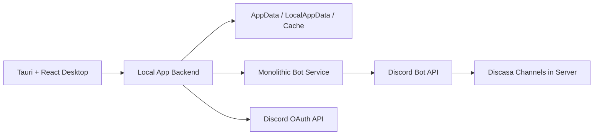

# Discasa Project Documentation

This document describes the current Discasa architecture, responsibilities, main flows, storage model, local configuration, and operational notes.

## 1. Goal

Discasa is a desktop application for organizing files and media while using Discord as the remote storage backend. The core idea is to give the user a rich local library experience while files and snapshots are persisted in private channels inside a Discord server.

Discasa must keep working even if a Discord server plan or boost level changes. For that reason, Discasa uses a fixed `10 MiB` upload limit per Discord attachment and splits larger files into chunks.

## 2. Components

### 2.1 `art`

Contains the project artwork sources and asset-generation scripts.

```text
art
  app
  bot
  fonts
  scripts
  sources
```

The scripts in `art/scripts` read source artwork from the root `art` folder and write generated desktop assets back into `discasa_app`.

### 2.2 `discasa_app`

Contains the main application.

```text
discasa_app
  apps/desktop
  apps/server
  packages/shared
```

Responsibilities:

- desktop interface;
- Discord OAuth;
- local API used by the interface;
- local persistence;
- library, file, and thumbnail cache;
- optional local mirroring;
- large-file chunking;
- storage manifests;
- snapshot synchronization;
- automatic external file import;
- attachment recovery and URL relinking;
- bot coordination;
- UI language selection and runtime translation.

### 2.3 `discasa_bot`

Contains the Discord bot HTTP service.

```text
discasa_bot
  src/index.ts
```

The bot is intentionally monolithic because it is expected to be hosted online. Keeping the hosted service in one source file reduces deployment surface and keeps all bot-only logic easy to audit.

Current responsibilities:

- start the `discord.js` client;
- respond to `/health`;
- report Discasa's fixed upload limit;
- inspect whether the bot and Discasa structure exist in a server;
- create or reuse the category and channels;
- upload attachments;
- delete storage messages;
- list raw attachment pages from `discasa-drive`;
- resolve a specific attachment reference;
- read and write snapshots.

Responsibilities kept out of the bot and owned by the app:

- decide which files are new in `discasa-drive`;
- filter internal Discasa files;
- compare known attachments;
- run the snapshot recovery/relink loop;
- move files to trash;
- restore files;
- permanently delete library items;
- list eligible servers with the user's OAuth token.

This design keeps the bot lightweight for online hosting and high-concurrency scenarios.

## 3. High-Level Diagram



## 4. Discord Structure

When Discasa is applied to a server, the expected structure is:

```text
Discasa
  #discasa-drive
  #discasa-index
  #discasa-trash
```

### 4.1 `discasa-drive`

Channel used for active files. Each normal upload creates a message with one attachment. Large files are stored as multiple `.discasa.partXXXX` messages.

Files manually uploaded to this channel outside the Discasa interface are detected automatically by the app and imported into the library.

### 4.2 `discasa-index`

Channel used for JSON snapshots:

- `discasa-index.snapshot.json`;
- `discasa-folder.snapshot.json`;
- `discasa-config.snapshot.json`;
- `discasa-install.marker.json`.

It can also contain legacy snapshots, such as `discasa-index.json`.

### 4.3 `discasa-trash`

Channel used for items moved to trash.

### 4.4 Legacy Channels

Older installations can have:

- `discasa-folder`;
- `discasa-config`.

Discasa still attempts to migrate or recover snapshots from these channels when needed.

## 5. Storage Model

### 5.1 Fixed Limit

Discasa's operational limit is:

```text
10 MiB = 10 * 1024 * 1024 bytes = 10485760 bytes
```

This limit is fixed and does not depend on the Discord server boost level or plan.

Reasoning:

- if a server accepts larger files today but is downgraded later, future uploads could break;
- always using `10 MiB` keeps all supported servers inside the smallest expected limit;
- larger files still work through chunking.

### 5.2 Chunking

The app decides whether a file must be split. When `size > 10 MiB`, it creates parts smaller than the limit and sends each part to the bot for Discord upload.

The manifest records:

- `chunked` mode;
- manifest version;
- chunk size;
- total chunk count;
- total size;
- SHA-256 hash for the full file;
- part list with name, size, hash, URL, channel ID, and message ID.

### 5.3 Small Files

Files up to `10 MiB` are sent as a single attachment.

### 5.4 Large Files

Files larger than `10 MiB` are sent as parts. The interface still treats the item as a single file.

## 6. Snapshots

Discasa uses snapshots to rebuild remote state.

### 6.1 Index Snapshot

Contains the library item list without desktop runtime URLs.

Relevant item fields:

- `id`;
- `name`;
- `size`;
- `mimeType`;
- `guildId`;
- `uploadedAt`;
- `attachmentUrl`;
- `attachmentStatus`;
- `storageChannelId`;
- `storageMessageId`;
- `storageManifest`;
- `isFavorite`;
- `isTrashed`;
- `originalSource`;
- `savedMediaEdit`.

### 6.2 Folder Snapshot

Contains:

- folders/albums;
- item-to-folder relationships;
- ordering;
- timestamps.

### 6.3 Config Snapshot

Contains preferences persisted in Discord:

- accent color;
- minimize/close to tray;
- thumbnail zoom;
- gallery display mode;
- viewer mouse wheel behavior;
- sidebar state;
- local mirror configuration;
- interface language.

## 7. Login and Installation Flow

1. User starts Discord login.
2. Browser opens the OAuth flow.
3. Local backend receives the callback.
4. App lists eligible servers.
5. User chooses a server.
6. App checks whether the bot is present.
7. If needed, user installs the bot.
8. App applies Discasa to the server.
9. Bot creates or reuses the category and channels.
10. App hydrates remote snapshots.
11. App runs attachment recovery/relink.
12. App imports external files found in Discord or local mirror storage.
13. Main interface opens.

During the longer apply/sync step, the interface shows a dynamic loading screen so the user can see that work is still in progress.

## 8. Upload Flow

1. User drags files into the interface.
2. Desktop sends files to the local backend.
3. Backend checks the active storage context.
4. For each file:
   - if `<= 10 MiB`, send once;
   - if `> 10 MiB`, split into chunks.
5. Bot performs targeted Discord uploads.
6. App creates library records.
7. App updates snapshots.
8. App updates local cache and thumbnails when applicable.

## 9. Automatic Import

### 9.1 Files in `discasa-drive`

The app asks the bot for raw attachment pages and then locally handles:

- internal Discasa file filtering;
- comparison against known items;
- deduplication by channel/message/name/size and URL;
- new record creation.

This allows files manually uploaded to `discasa-drive` to appear in the interface.

### 9.2 Files in the Local Mirror Folder

When local mirroring is enabled:

1. app scans the mirror folder root;
2. ignores files managed by Discasa;
3. ignores temporary files or files that are still being copied;
4. uploads new files to Discord;
5. uses chunking when needed;
6. adopts the local file into Discasa's managed naming scheme;
7. updates library and snapshots.

## 10. Trash, Restore, and Delete

These flows are coordinated by the app:

- move to trash;
- restore;
- permanently delete.

The bot only performs message uploads/deletes when requested.

For chunked files, the app moves, restores, or deletes every manifest part.

## 11. Recovery and Relink

Discord attachment URLs can change or expire. The app performs snapshot recovery:

1. iterate through each snapshot item;
2. resolve direct channel/message references;
3. when needed, ask the bot for a targeted search in candidate channels;
4. update `attachmentUrl`, channel, and message;
5. mark item as `missing` when it cannot be resolved;
6. generate warnings for the interface.

The loop and decisions stay in the app. The bot only attempts to resolve a specific attachment reference.

## 12. Local Mirroring

Local mirroring keeps managed copies on disk.

Default location:

```text
%LOCALAPPDATA%\Discasa\Cache\files
```

Thumbnails:

```text
%LOCALAPPDATA%\Discasa\Cache\thumbnails
```

Configuration and session:

```text
%APPDATA%\Discasa
```

If the user configured a custom folder and it does not exist on another computer, setup asks for a new folder or allows the default path.

## 13. Local Cache

The desktop keeps a per-server cache to render the library quickly at startup. The backend then reconciles with the current Discord snapshots.

This cache improves first paint, but the authoritative state remains the remote snapshot and app local persistence.

## 14. Runtime Language Switching

The desktop supports English and Portuguese. Language is stored in `DiscasaConfig.language`, so it can sync through the same config snapshot as the rest of the app settings.

The source interface remains English. Runtime translation files live in:

```text
discasa_app/apps/desktop/src/i18n
  en.ts
  pt.ts
  index.ts
```

Changing the language in Settings applies immediately without restarting the desktop app. The runtime translator also watches newly rendered interface nodes so modal content and delayed UI updates are translated after the switch.

## 15. Local App API

The local backend runs by default at:

```text
http://localhost:3001
```

Main areas:

- Discord authentication;
- session;
- eligible server listing;
- bot status;
- Discasa initialization;
- library;
- albums/folders;
- upload;
- content and thumbnails;
- settings/config;
- automatic external import.

## 16. Bot API

The bot runs by default at:

```text
http://localhost:3002
```

Main endpoints:

- `GET /health`;
- `GET /guilds/:guildId/upload-limit`;
- `GET /guilds/:guildId/setup-status`;
- `POST /guilds/:guildId/initialize`;
- `POST /files/upload`;
- `POST /files/delete-messages`;
- `POST /files/drive/attachments`;
- `POST /files/resolve-attachment`;
- snapshot endpoints.

The bot should not regain library product rules. Whenever a rule can run in the app, it should stay in the app.

## 17. Rate Limits and Concurrency

Discasa reduces pressure on the bot by keeping coordination in the app:

- app chunks files before calling the bot;
- app filters and recovers state locally;
- bot serializes Discord writes with a queue;
- large uploads become a controlled sequence of parts;
- fixed `10 MiB` limit avoids boost/plan dependence;
- bot stays a thin adapter, reducing CPU and memory per user.

In a high-concurrency scenario, the main cost moves to local apps. The hosted bot service receives smaller, more predictable operations.

## 18. Mock Mode

`MOCK_MODE=true` allows development without real Discord access.

In the app:

```env
MOCK_MODE=true
```

In the bot:

```env
MOCK_MODE=true
```

For real Discord integration, use `MOCK_MODE=false` and configure OAuth credentials plus the bot token.

## 19. Development

Install:

```powershell
cd discasa_app
npm install

cd ..\discasa_bot
npm install
```

Full run:

```powershell
.\start.bat
```

Stop processes:

```powershell
.\stop.bat
```

Checks:

```powershell
cd discasa_app
npm run check

cd ..\discasa_bot
npm run check
```

Builds:

```powershell
cd discasa_app
npm --workspace @discasa/desktop run build
npm --workspace @discasa/server run build

cd ..\discasa_bot
npm run build
```

## 20. Local Reset

Use:

```powershell
.\hard-reset.bat
```

It removes:

- `node_modules`;
- `package-lock.json`;
- local builds;
- Discasa local cache and data;
- legacy prototype data.

It does not remove Discord channels, messages, or files.

## 21. Maintenance Guidelines

- Keep product rules in the app.
- Keep the hosted bot small, predictable, and monolithic.
- Do not use a dynamic upload limit based on Discord boost level.
- Preserve chunking for files larger than `10 MiB`.
- Avoid making the bot process full snapshots when the app can coordinate.
- Validate app and bot before pushing changes.
- Update this document when flows or responsibilities change.
