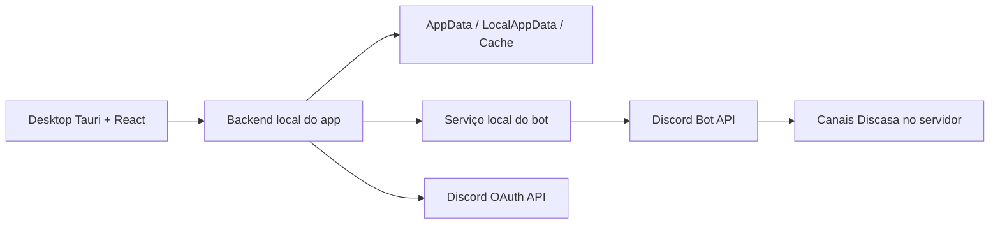

# Documentação do Projeto Discasa

Este documento descreve o estado atual do Discasa: arquitetura, responsabilidades, fluxos principais, modelo de armazenamento, configuração local e cuidados operacionais.

## 1. Objetivo

Discasa é um aplicativo desktop para organizar arquivos e mídia usando Discord como backend de armazenamento. A ideia central é permitir que o usuário interaja com uma biblioteca local rica, enquanto os arquivos e snapshots ficam persistidos em canais privados dentro de um servidor Discord.

O app deve continuar funcionando mesmo em cenários de mudança de plano do Discord. Por isso, o Discasa usa limite fixo de `10 MiB` por arquivo enviado ao Discord e divide arquivos maiores em chunks.

## 2. Componentes

### 2.1 `discasa_app`

Contém o aplicativo principal.

```text
discasa_app
  apps/desktop
  apps/server
  packages/shared
  art
```

Responsabilidades:

- interface desktop;
- OAuth com Discord;
- API local usada pela interface;
- persistência local;
- cache de biblioteca, arquivos e thumbnails;
- espelhamento local;
- chunking de arquivos grandes;
- manifestos de armazenamento;
- sincronização de snapshots;
- importação automática de arquivos externos;
- recuperação de anexos e relink de URLs;
- coordenação do bot.

### 2.2 `discasa_bot`

Contém o serviço local do bot Discord.

```text
discasa_bot
  src
  packages/shared
  art
```

Responsabilidades atuais:

- iniciar cliente `discord.js`;
- responder `/health`;
- informar limite fixo de upload do Discasa;
- inspecionar se o bot e a estrutura Discasa existem em um servidor;
- criar/reusar categoria e canais;
- enviar anexos;
- excluir mensagens de armazenamento;
- listar páginas brutas de anexos do `discasa-drive`;
- resolver uma referência pontual de anexo;
- ler e escrever snapshots.

Responsabilidades removidas do bot e movidas para o app:

- decidir o que é arquivo novo no `discasa-drive`;
- filtrar arquivos internos do Discasa;
- comparar anexos conhecidos;
- executar o loop de recovery/relink do snapshot;
- mover arquivo para lixeira;
- restaurar arquivo;
- excluir permanentemente item da biblioteca;
- listar servidores elegíveis via token OAuth do usuário.

Esse desenho deixa o bot mais leve para cenários com muitos usuários simultâneos.

## 3. Diagrama de Alto Nível



## 4. Estrutura no Discord

Ao aplicar o Discasa em um servidor, a estrutura esperada é:

```text
Discasa
  #discasa-drive
  #discasa-index
  #discasa-trash
```

### 4.1 `discasa-drive`

Canal usado para arquivos ativos. Cada upload normal gera uma mensagem com um anexo. Arquivos grandes são armazenados como múltiplas mensagens de partes `.discasa.partXXXX`.

Arquivos enviados manualmente nesse canal, fora da interface do Discasa, são detectados automaticamente pelo app e entram na biblioteca.

### 4.2 `discasa-index`

Canal usado para snapshots JSON:

- `discasa-index.snapshot.json`;
- `discasa-folder.snapshot.json`;
- `discasa-config.snapshot.json`;
- `discasa-install.marker.json`.

Também pode conter snapshots legados, como `discasa-index.json`.

### 4.3 `discasa-trash`

Canal usado para armazenamento de itens enviados para a lixeira.

### 4.4 Canais Legados

Instalações antigas podem ter:

- `discasa-folder`;
- `discasa-config`.

O Discasa ainda tenta migrar/recuperar snapshots desses canais quando necessário.

## 5. Modelo de Armazenamento

### 5.1 Limite Fixo

O limite operacional do Discasa é:

```text
10 MiB = 10 * 1024 * 1024 bytes = 10485760 bytes
```

Esse limite é fixo e independe do nível de boost/plano do servidor Discord.

Motivo:

- se um servidor aceita arquivos maiores hoje, mas recebe downgrade depois, uploads futuros poderiam quebrar;
- usando sempre `10 MiB`, todos os servidores suportados permanecem dentro do menor limite esperado;
- arquivos maiores continuam funcionando por chunking.

### 5.2 Chunking

O app decide se um arquivo precisa ser dividido. Quando `size > 10 MiB`, ele cria partes menores que o limite e envia cada parte ao bot para upload no Discord.

O manifesto registra:

- modo `chunked`;
- versão do manifesto;
- tamanho do chunk;
- número total de chunks;
- tamanho total;
- hash SHA-256 do arquivo completo;
- lista de partes com nome, tamanho, hash, URL e IDs de canal/mensagem.

### 5.3 Arquivos Pequenos

Arquivos até `10 MiB` são enviados como um anexo único.

### 5.4 Arquivos Grandes

Arquivos maiores que `10 MiB` são enviados como partes. A interface continua tratando o item como um arquivo único.

## 6. Snapshots

O Discasa usa snapshots para reconstruir o estado remoto.

### 6.1 Index Snapshot

Contém a lista de itens da biblioteca sem URLs runtime do desktop.

Campos relevantes por item:

- `id`;
- `name`;
- `size`;
- `mimeType`;
- `guildId`;
- `uploadedAt`;
- `attachmentUrl`;
- `attachmentStatus`;
- `storageChannelId`;
- `storageMessageId`;
- `storageManifest`;
- `isFavorite`;
- `isTrashed`;
- `originalSource`;
- `savedMediaEdit`.

### 6.2 Folder Snapshot

Contém:

- pastas/álbuns;
- relação entre item e pasta;
- ordenação;
- timestamps.

### 6.3 Config Snapshot

Contém preferências persistidas no Discord:

- cor de destaque;
- minimizar/fechar para bandeja;
- zoom de thumbnail;
- modo de visualização da galeria;
- comportamento da roda do mouse;
- estado da sidebar;
- configuração de espelhamento local.

## 7. Fluxo de Login e Instalação

1. Usuário inicia login com Discord.
2. Browser abre fluxo OAuth.
3. Backend local recebe callback.
4. App lista servidores elegíveis.
5. Usuário escolhe servidor.
6. App verifica se o bot está presente.
7. Se necessário, usuário instala o bot.
8. App aplica o Discasa no servidor.
9. Bot cria/reusa categoria e canais.
10. App hidrata snapshots remotos.
11. App faz recovery/relink de anexos.
12. App importa arquivos externos encontrados.
13. Interface principal abre.

Durante a etapa demorada de aplicar/sincronizar, a interface mostra uma tela de carregamento dinâmica para deixar claro que há trabalho em andamento.

## 8. Fluxo de Upload

1. Usuário arrasta arquivos para a interface.
2. Desktop envia arquivos para o backend local.
3. Backend local verifica o contexto ativo.
4. Para cada arquivo:
   - se `<= 10 MiB`, envia uma vez;
   - se `> 10 MiB`, divide em chunks.
5. Bot executa uploads pontuais no Discord.
6. App cria registros de biblioteca.
7. App atualiza snapshots.
8. App atualiza cache local e thumbnails quando aplicável.

## 9. Importação Automática

### 9.1 Arquivos no `discasa-drive`

O app consulta páginas brutas de anexos no bot e faz localmente:

- filtragem de arquivos internos do Discasa;
- comparação contra itens conhecidos;
- deduplicação por canal/mensagem/nome/tamanho e URL;
- criação de registros novos.

Isso permite que arquivos enviados manualmente no canal `discasa-drive` apareçam na interface.

### 9.2 Arquivos na Pasta Espelhada

Quando o espelhamento local está ativado:

1. app varre a raiz da pasta espelhada;
2. ignora arquivos gerenciados pelo Discasa;
3. ignora arquivos temporários ou ainda sendo copiados;
4. envia arquivos novos ao Discord;
5. usa chunking quando necessário;
6. adota o arquivo local para o nome gerenciado pelo Discasa;
7. atualiza biblioteca e snapshots.

## 10. Trash, Restore e Delete

Esses fluxos são coordenados pelo app:

- mover para lixeira;
- restaurar;
- apagar permanentemente.

O bot apenas executa uploads/deletes de mensagens quando solicitado.

Para arquivos chunked, o app move/restaura/deleta todas as partes do manifesto.

## 11. Recovery e Relink

URLs de anexos do Discord podem mudar ou expirar. O app executa o recovery do snapshot:

1. percorre cada item do snapshot;
2. resolve referência direta por canal/mensagem;
3. quando necessário, pede ao bot busca pontual em canais candidatos;
4. atualiza `attachmentUrl`, canal e mensagem;
5. marca item como `missing` quando não consegue resolver;
6. gera warnings para a interface.

O loop e as decisões ficam no app; o bot apenas tenta resolver uma referência de anexo.

## 12. Espelhamento Local

O espelhamento local permite manter cópias em disco.

Local padrão:

```text
%LOCALAPPDATA%\Discasa\Cache\files
```

Thumbnails:

```text
%LOCALAPPDATA%\Discasa\Cache\thumbnails
```

Configuração e sessão:

```text
%APPDATA%\Discasa
```

Se o usuário configurou uma pasta customizada e ela não existe em outro computador, o setup pede uma nova pasta ou permite usar o padrão.

## 13. Cache Local

O desktop mantém cache por servidor para renderizar a biblioteca rapidamente na inicialização. Depois, o backend reconcilia com os snapshots atuais do Discord.

Esse cache melhora o primeiro paint, mas o estado autoritativo continua sendo o snapshot remoto e a persistência local do app.

## 14. API Local do App

O backend local roda por padrão em:

```text
http://localhost:3001
```

Principais áreas:

- autenticação Discord;
- sessão;
- listagem de servidores;
- status do bot;
- inicialização do Discasa;
- biblioteca;
- álbuns/pastas;
- upload;
- conteúdo e thumbnails;
- settings/config;
- importação automática externa.

## 15. API Local do Bot

O bot roda por padrão em:

```text
http://localhost:3002
```

Principais áreas:

- `GET /health`;
- `GET /guilds/:guildId/upload-limit`;
- `GET /guilds/:guildId/setup-status`;
- `POST /guilds/:guildId/initialize`;
- `POST /files/upload`;
- `POST /files/delete-messages`;
- `POST /files/drive/attachments`;
- `POST /files/resolve-attachment`;
- endpoints de snapshots.

O bot não deve voltar a concentrar regras de biblioteca. Sempre que uma regra puder rodar no app, ela deve ficar no app.

## 16. Rate Limits e Concorrência

O Discasa foi ajustado para reduzir pressão no bot:

- app faz chunking antes de chamar o bot;
- app faz filtragem e recovery localmente;
- bot serializa escritas no Discord com uma fila;
- uploads grandes viram uma sequência controlada de partes;
- limite fixo de `10 MiB` evita dependência de boost/plano;
- bot fica como adaptador fino, reduzindo CPU/memória por usuário.

Em um cenário com muitos usuários simultâneos, o custo principal passa para os apps locais. O serviço do bot recebe operações menores e mais previsíveis.

## 17. Mock Mode

`MOCK_MODE=true` permite desenvolver sem Discord real.

No app:

```env
MOCK_MODE=true
```

No bot:

```env
MOCK_MODE=true
```

Para integração real com Discord, use `MOCK_MODE=false` e configure credenciais OAuth e token do bot.

## 18. Desenvolvimento

Instalação:

```powershell
cd discasa_app
npm install

cd ..\discasa_bot
npm install
```

Execução completa:

```powershell
.\start.bat
```

Parar processos:

```powershell
.\stop.bat
```

Checks:

```powershell
cd discasa_app
npm run check

cd ..\discasa_bot
npm run check
```

Builds:

```powershell
cd discasa_app
npm --workspace @discasa/desktop run build
npm --workspace @discasa/server run build

cd ..\discasa_bot
npm run build
```

## 19. Reset Local

Use:

```powershell
.\hard-reset.bat
```

Ele remove:

- `node_modules`;
- `package-lock.json`;
- builds locais;
- cache e dados locais do Discasa;
- dados legados do protótipo.

Ele não remove canais, mensagens ou arquivos no Discord.

## 20. Diretrizes de Manutenção

- Manter regras de produto no app.
- Manter o bot pequeno e previsível.
- Não usar limite dinâmico de upload baseado em boost do Discord.
- Preservar chunking para arquivos maiores que `10 MiB`.
- Evitar bot processando snapshots completos quando o app puder coordenar.
- Validar app e bot antes de push.
- Atualizar este documento quando fluxos ou responsabilidades mudarem.
